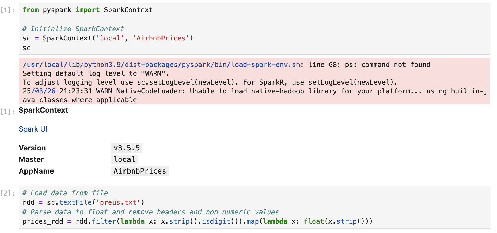
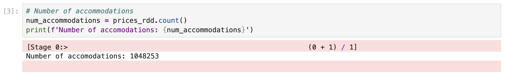
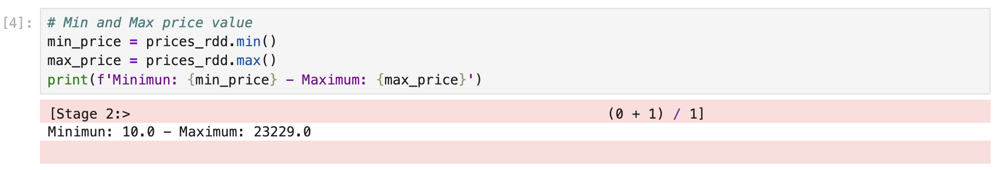
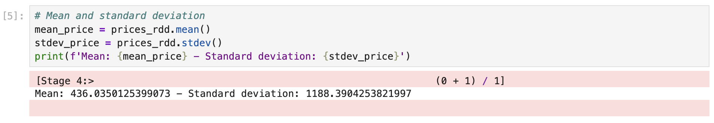
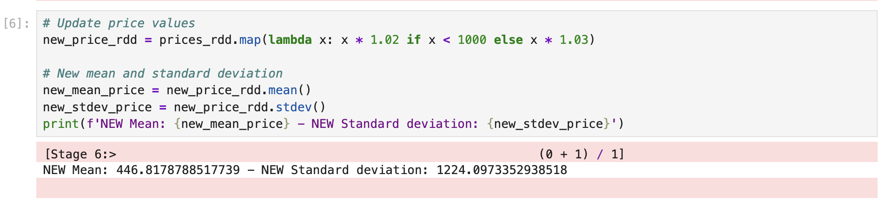
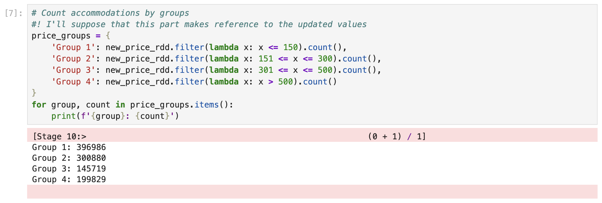

# En el [repositorio del curso](https://raw.githubusercontent.com/tnavarrete-iedib/bigdata-24-25/refs/heads/main/preus.txt) puedes encontrar un archivo con los precios de todos los alojamientos de Airbnb en la isla de Menorca, con datos actualizados el 31 de diciembre de 2.

Todo el contenido mostrado en este apartado ha sido ejecutado en el nodo JupyterLab del clúster, pero se puede ver un resumen completo del código en el [cuaderno jupyter](./section3.ipynb) de este directorio.

# Haz otro cuaderno de Jupyter en el nodo con JupyterLab de tu clúster donde, utilizando PySpark y RDDs (no puedes utilizar DataFrames de Spark SQL), debes calcular:

-  # El número de alojamientos (número de valores)

-  # Los valores mínimo y máximo

-  # La media y la desviación estándar

-  # Nos dicen que todos los alojamientos con menor precio que 1000 euros lo subirán un 2%, mientras que los de 1000 euros o más lo harán en un 3%. Calcula la nueva media y desviación típica después de aplicar estas subidas.

# Ahora queremos definir los siguientes intervalos de precios:

-  # Grupo 1: Hasta 150 euros (incluido)
-  # Grupo 2: Desde 151 euros a 300 euros, ambos inclusive
-  # Grupo 3: Desde 301 euros a 500 euros, ambos inclusive
-  # Grupo 4: Más de 500 euros

# Tienes que calcular cuántos alojamientos hay dentro de cada grupo.

