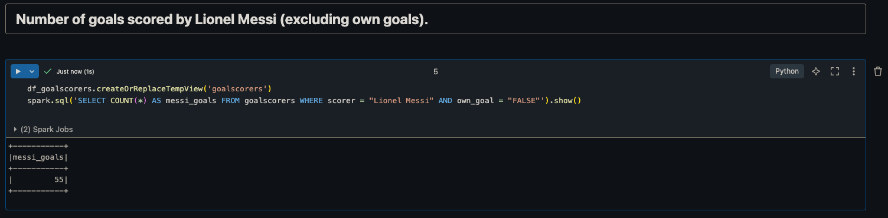
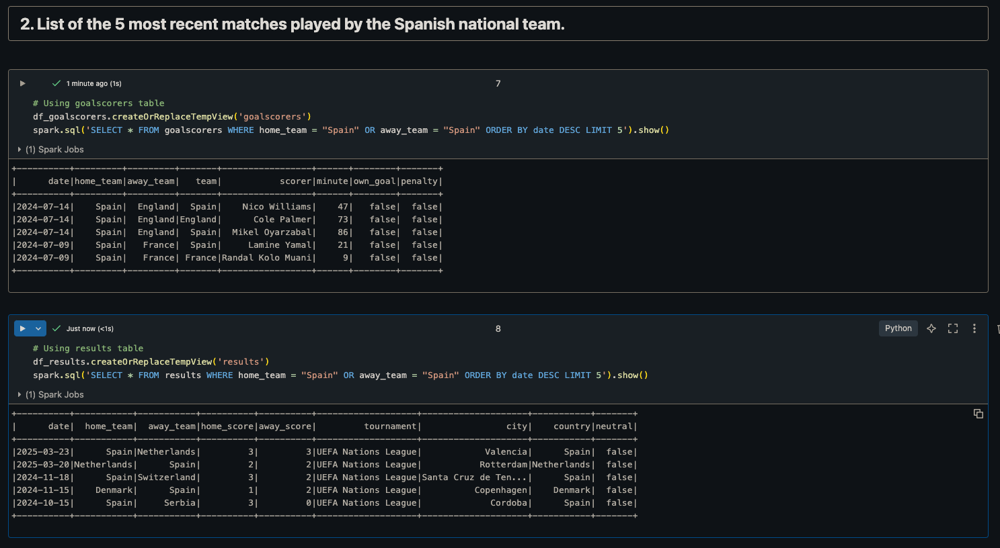
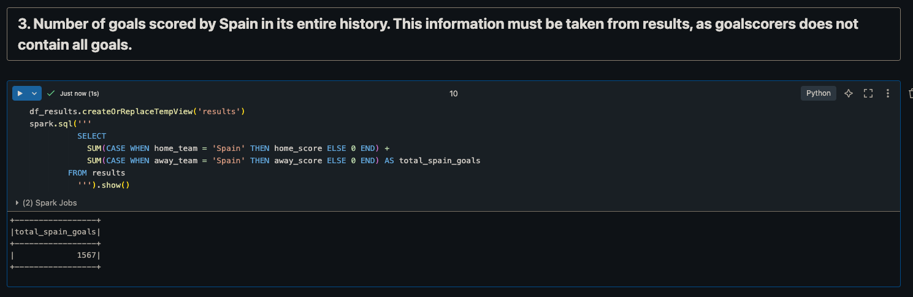
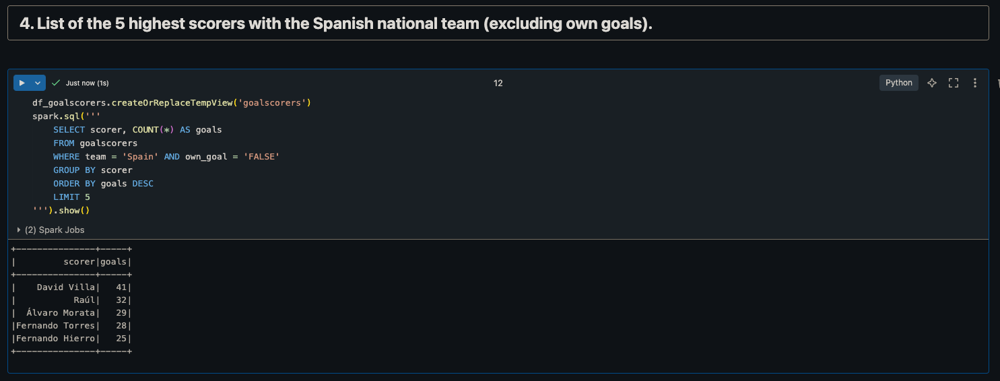
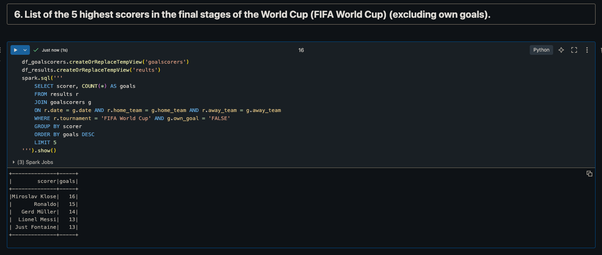

# Creación del recurso y clúster

En esta primera parte de la tarea explicaré el proceso necesario para la creación del recurso a utilizar en toda la tarea. La única diferencia será la carga de los datos ya que eso será exclusivo de cada una de los apartados. Esta parte es exactamente igual que en los apuntes.

El primer paso es irse al marketplace de Azure, buscar '_databricks_', seleccionar el primero, rellenar la información y esperar a que el recurso sea lanzado correctamente (_deployed_).

Una vez finalizado este proceso, si se hace click en '_Go to resource_' aparecerá el panel de la última imagen. Desde éste se podrá abrir el espacio de trabajo (_workspace_) de databricks y ver si siguiente panel:

El siguiente paso es crear un clúster de Spark. Como se indica en los apuntes, dado que tenemos recursos limitados, este clúster únicamente dispondrá de un nodo. En la parte superior izquierda, se hace click en '_+ New_', se selecciona '_Cluster_' y se siguen los pasos (los mismos que en los apuntes).

Con el recurso ya creado por completo, lo que resta es añadir los datos necesarios para este apartado.

# Adición de los datos

El proceso descrito a continuación será replicado para el resto de apartados

Cuando los datos han sido añadidos, aparecerán bajo el _hive_metastore_.

# Creación del cuaderno y consultas a los datos.

Una vez los datos han sido cargados correctamente, se puede crear un nuevo cuaderno desde la parte superior izquierda (_+ New_) y esta vez seleccionamos '_Notebook_'.

### Carga de los datos en el cuaderno

El primer paso es instanciar los _data frames_, al igual que se ha realizado en repetidas ocasiones durante el curso con Python y la librería _pandas_, pero esta vez mediante Spark.

En mi caso he decidido optar por usar la sintaxis SQL por ser más familiar para mi.

