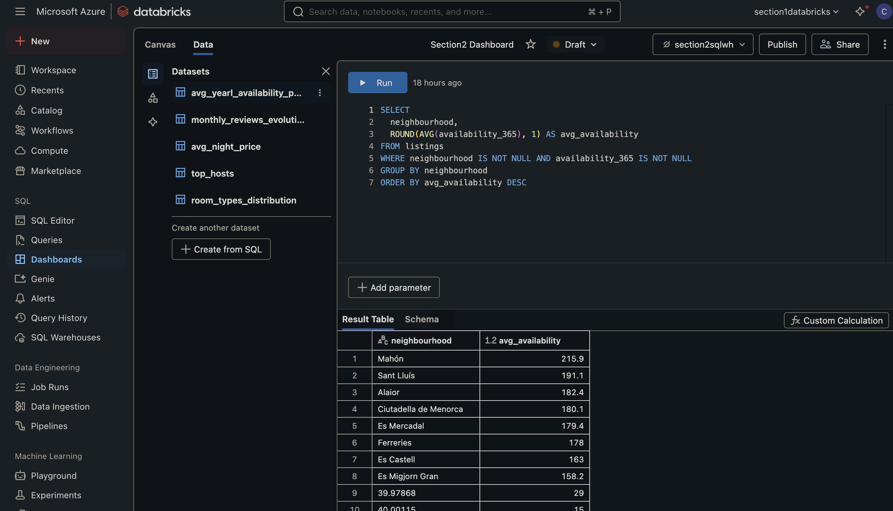
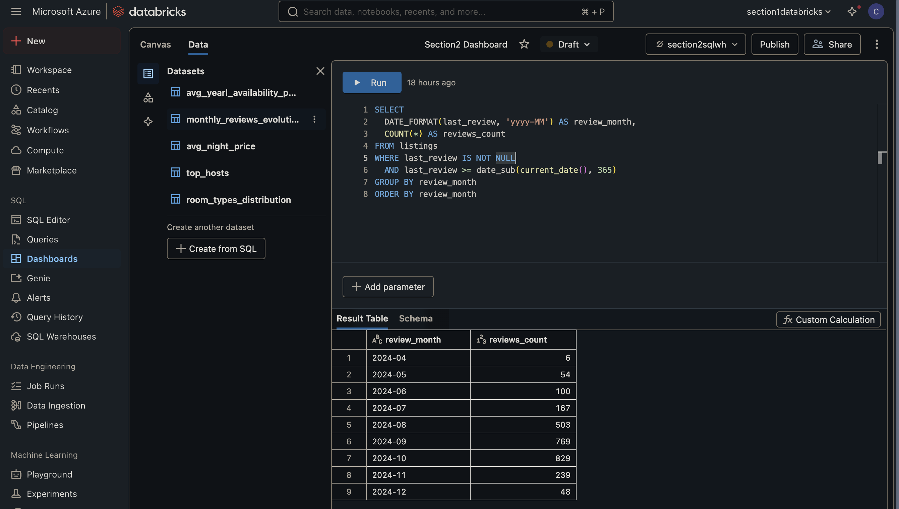

# Crear el _dashboard_

Como se explica en los apuntes, antes de poder acceder a las funcionalidades del área de trabajo de _databricks_ que se requiren, es necesario actualizar el plan actual al _Premium_. Una vez finalizado ese proceso, accedemos al área de trabajo

Una vez actualizado el plan, se podrá ver a la izquierda del panel una nueva sección _SQL_ además de permitir crear nuevos recursos como se muestra en la siguiente imagen, donde se crea el almacén SQL necesario para este apartado. Se sigue el proceso mostrado y explicado en los apuntes (es importante que los paráemtros del segundo paso sean los mismos).


Tras este paso, se cargan los datos (en este caso del archivo descargado [listings.csv](./listings.csv)) de la misma forma que se ha explicado en el apartado anterior ([ver apartado anterior](../section1/README.md)).


Cuando los datos han sido cargados, es momento de crear el dashboard haciendo click en _Dashboards_ en el panel lateral y creando uno nuevo.


Una vez ha sido creado, queda añadir los elementos gráficos de éste.

## Elementos gráficos

Los elementos gráficos, como su nombre indica, permiten ver cierta informaicón de forma visual, resultado en una fácil comprensión de éstos. En el caso de _databricks_ los datos de los gráficos provienen de consultas SQL (en el aparado de _Data_ se crean los datasets) y se asignan a éstos. Los pasos mostrados a continuación se repiten para cada uno de los gráficos (las consultas están especificadas más adelante para cada uno).

-  Crear un nuevo dataset:


-  Asignar dataset a un gráfico:


La asignación de los ejex X e Y dependerá del gráfico en concreto. A continuación se muestran las consultas SQL realizadas para cada uno de los gráficos del resultado final.

#### 1. Contador: Precio medio por noche

```sql
SELECT
  ROUND(AVG(TRY_CAST(price AS DOUBLE)), 2) AS avg_price
FROM listings
WHERE price IS NOT NULL
```


#### 2. Tabla: Top hosts

```sql
SELECT host_name, host_id, COUNT(*) AS total_listings
FROM listings
WHERE host_id IS NOT NULL AND host_name IS NOT NULL
GROUP BY host_id, host_name
ORDER BY total_listings DESC
```


#### 3. Gráfico de queso o _pie chart_: Distribución de tipos de habitación

```sql
SELECT
  room_type,
  COUNT(*) AS total,
  ROUND(100.0 * COUNT(*) / SUM(COUNT(*)) OVER (), 2) AS percentage
FROM listings
WHERE room_type IS NOT NULL
GROUP BY room_type
ORDER BY total DESC
```


#### 4. Gráfico de barras: Disponibilidad anual media por barrio

```sql
SELECT
  neighbourhood,
  ROUND(AVG(availability_365), 1) AS avg_availability
FROM listings
WHERE neighbourhood IS NOT NULL AND availability_365 IS NOT NULL
GROUP BY neighbourhood
ORDER BY avg_availability DESC
```



#### 5. Gráfico de linea: Evolución de reseñas por mes

```sql
SELECT
  DATE_FORMAT(last_review, 'yyyy-MM') AS review_month,
  COUNT(*) AS reviews_count
FROM listings
WHERE last_review IS NOT NULL
  AND last_review >= date_sub(current_date(), 365)
GROUP BY review_month
ORDER BY review_month
```



## Filtros o afinadores

Los filtros se asignan a valores existentes de los datasets creados y se asignan de la forma que se muestra en la imagen (en el panel de la derecha, como con los gráficos). Se podrá ver cuando se selecciona un filtro, que se pone un borde azul en los gráficos en los que se aplica dicho filtro (ver capturas de pantalla de los filtros creados).


#### 1. Top Hosts


#### 2. Tipos de habitación


#### 3. Barrio o vecindario


#### 4. Disponibilidad anual


## Resultado final


