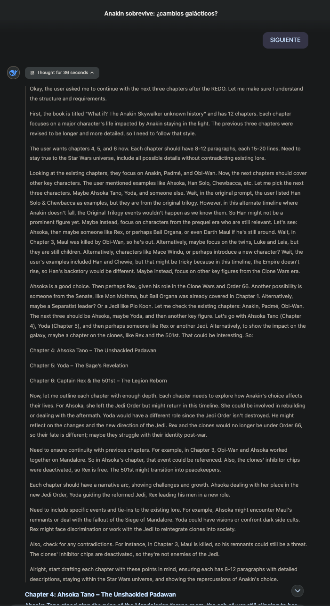
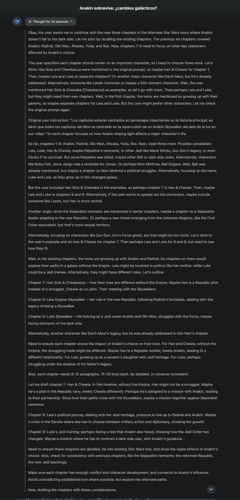
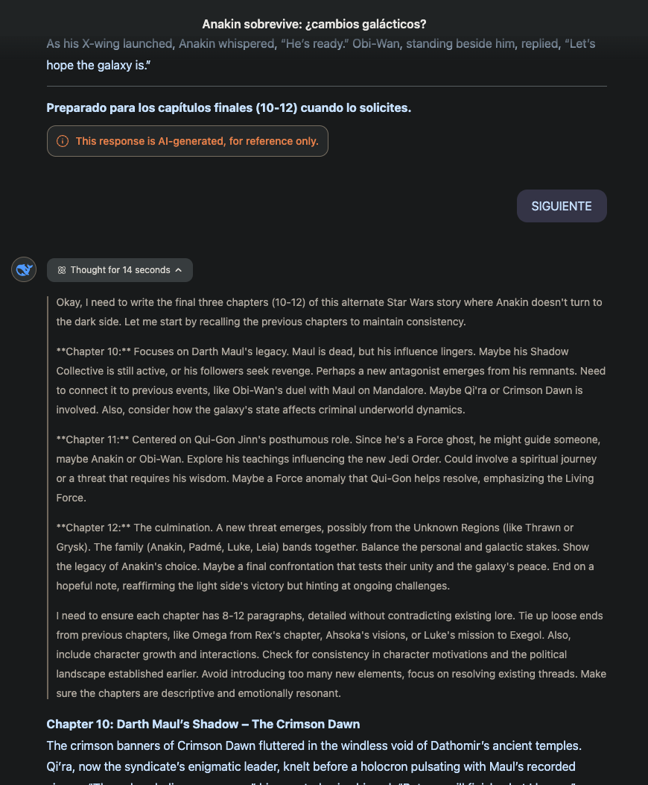

### Sobre un chatbot basado en LLM de su elección (ChatGPT, Gemini, Claude, DeepSeek) escriba un libro de un mínimo de doce páginas siguiendo el siguiente esquema.

#### 1) Escriba un prompt inicial lo suficientemente largo, explicando el texto que desea producir, el título de su obra, la audiencia, el estilo, la longitud de cada capítulo y pida una propuesta de índice de doce capítulos. El texto puede ser de cualquier estilo que desee: ficción, de ensayo, técnico...

En mi caso he decidido usar el modelo DeepThink(R1) de DeepSeek para esta tarea y probar qué tan bien va este chatbot en comparación con los más usados actualmente. Para esta primera parte he optado por hacer un _remake_ de la famosa saga Star Wars pero ¿qué hubiera pasado si Anakin Skywalker no hubiera sucumbido al lado oscuro? El prompt ejecutado es el siguiente:

```
Tengo curiosidad por saber qué hubiera pasado si George Lucas hubiera decidido que Anakin Skywalker no sucumbiera al lado oscuro, todas las repercusiones en las guerras, en el equilibrio galáctico, con Padme y sus hijos. Evidantemente es una pregunta que todos los fans de Star Wars nos hacemos y necesitamos saber.

Necesito que relates esta historia en un libro de 12 capítulos en total titulado 'What if? The Anakin Skywalker unknown history', en inglés. El libro deberá contener todos los detalles posibles sin faltar al universo ya existente y conocido de Star Wars.

Los capítulos estarán centrados en personajes importantes en la historia principal, es decir que todos los capítulos del libro se centrarán en la repercusión de un Anakin Skywalker del lado de la luz en sus vidas. El primer capítulo de los 12 totales puede ser una visión general de dicha repercusión sobre la galaxia, se tituaría 'Anakin Skywalker, the chosen one'. Por proponer algunos personajes para los capítulos: 'Han Solo & Chewaka', 'Ashoka', 'Padme', etc. Cada capítulo deberá estar compuesto de entre 8 y 12 párrafos de unas 15-20 líenas cada uno.

Antes de comenzar a escribir te indicaré con la palabra 'EMPEZAR' que puedes redactar los 3 primeros capítulos. Luego te iré escribiendo 'SIGUIENTE' para redactar los 3 siguientes en caso de que esté correcto o 'REDO' en caso de que desee redactar de vuelta los 3 capítulos. Si están claras las instrucciones, indícamelo con la palabra 'ENTENDIDO' en este chat.
```

No se trata de un prompt demasiado largo pero he intentado aportar los máximos detalles posibles.


#### 2) Con prontos sucesivos breves va extrayendo los capítulos consecutivos de su obra. Puede insertar correcciones si el resultado que obtiene no se ajusta a su idea.

El primer prompt realizado resulta ciertamente interesante porque, en palabras coloquiales, pasa por completo de mi cara:


Se puede ver que no sigue los requerimientos de longitud especificados, además de empezar a escribir sin recibir la confirmación por mi parte. En el siguiente prompt le indico que debe de seguir las instrucciones y le indico la palabra clave 'REDO' para que entienda que tiene que realizar una iteración sobre el prompt anterior.


Después de este prompt intermedio podríamos llamarle, toque de atención o redirección del flujo, tras cada 'SIGUIENTE' el chat mostraba qué estaba 'pensado' para los siguientes capítulos:








Este último prompt era innecesario realmente, pero estos han sido todos los pensamientos del agente en el chat.

#### 3) Obtenga la URL de la conversación y añádela al cuaderno de Colab que entregará en esta tarea.

Posteriormente a realizar la escritura del libro de 12 capítulos, me di cuenta de que no se puede compartir el chat de DeepSeek. De todas formas, las capturas mostradas y el contenido dentro del directorio [What if? The Anakin Skywalker unknown history](./What%20if?%20The%20Anakin%20Skywalker%20unknown%20history/) muestran el contenido completo del chat del que he hecho uso.

#### 4) Valore el resultado obtenido. ¿Hasta qué punto sirve como producto final? ¿Necesita mucho más trabajo? ¿El resultado es mejor o más malo de lo que esperaba?

El resultado final, a pesar de que me resulte ciertamente interesante a nivel de contenido (sin fijarme en detalles concretos sobre la saga o detalles de ser un poco friki), ciertamente no cumple al 100% con los requerimientos especificados. He decidido seguir con el segundo resultado ya que me parecía suficiente a nivel de estructura.

Lo más relevante a mencionar son los 'cuadros de pensamiento', donde el modelo explicaba lo que estaba 'pensando'. Se puede ver que éstos crecen y crecen (en tamaño y tiempo de pensamiento) hasta que en el último bloque de 3 capítulos se acorta de forma significativa. El motivo lo desconozco pero sí que puede existir una causalidad con el mensaje relacionado con el contenido generado por IA (a fin de cuentas, la obra no es nuestra y contiene derechos de autor).

Al final de cada capítulo ha añadido una frase o diálogo de carácter épico basado en el personaje en concreto sin que se le pidiera. Este hecho resulta interesante ya que el resultado final aporta un toque muy Star Wars, y que el modelo sea capaz de tomarse la libertada para hacerlo resulta ciertamente fascinante (recordar que no se ha configurado la opción 'web').

Como comentario final, el último prompt realizado decidí ejecutarlo para ver qué respondía solo por curiosidad ya que las coletillas de cada capítulo me resultaron intrigantes. El resultado no se quedó corto sin dudarlo.
