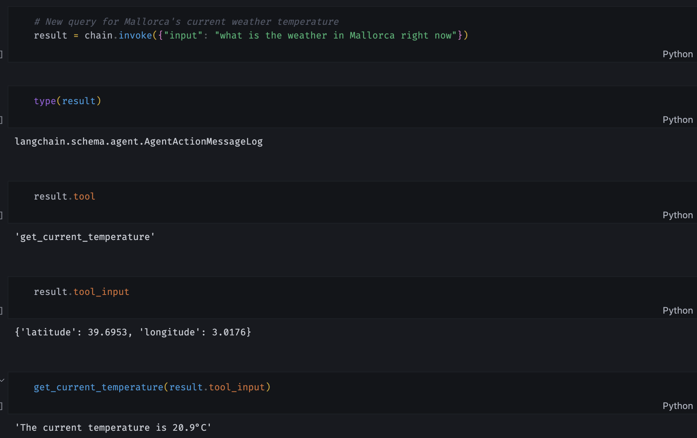
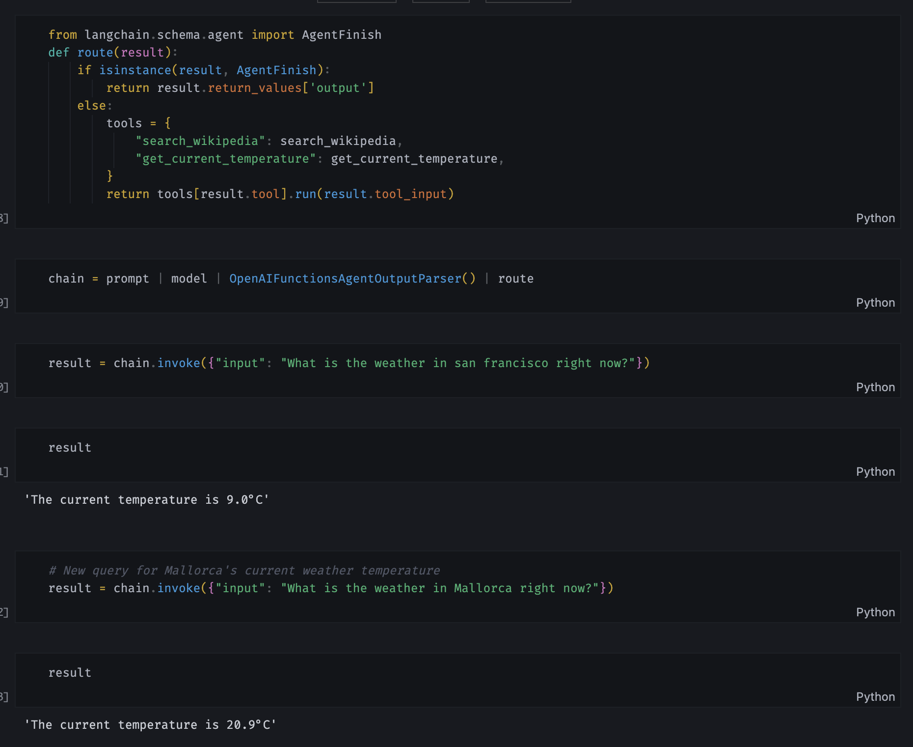

# 1) Escriviu una cel·la per consultar la temperatura a Palma en graus centígrads. Per aconseguir-ho, haureu de localitzar on hi ha configurada la temperatura en graus Fahrenheit i modificar-la.

El codi modificat per aquesta part de la tasca es troba a l'arxui [sanchezrecio_carlos_L1](./sanchezrecio_carlos_L1.ipynb), que es una modificació de l'original ([arxiu original](./tutorial_files/L1-openai_functions_student.ipynb)). Les modificaciones realitzades es troben en comentades dins el propi codi, però són les següents:

-  Modificació de l'unitat de temperatura:

> unit="fahrenheit" &rarr; unit="celsius"

```python
def get_current_weather(location, unit="celsius"):
    """Get the current weather in a given location"""
    weather_info = {
        "location": location,
        "temperature": "72",
        "unit": unit,
        "forecast": ["sunny", "windy"],
    }
    return json.dumps(weather_info)
```

Es important comentar el que diu el codi original:

> Example dummy function hard coded to return the same weather. In production, this could be your backend API or an external API

El resultat que es mostra en la modificació no es res més que un canvi de strings literal. Com indica, en aquesta funció que s'ha modificat, estaria el codi amb la cridada real a una API ([enllaç a RapidAPI amb cerca de _weather api_ gratuïtes](https://rapidapi.com/search?term=weather&sortBy=ByRelevance)). Actualment la resposta que es retorna es

> '{"location": {"location": "Palma de Mallorca, Spain"}, "temperature": "72", "unit": "celsius", "forecast": ["sunny", "windy"]}'

que comparada amb el del codi original

> '{"location": {"location": "Boston", "unit": "celsius"}, "temperature": "72", "unit": "fahrenheit", "forecast": ["sunny", "windy"]}'

es pràcticament idéntica.

# 2) **More complex chain**. Ampliau el conjunt de documents per poder respondre les següents preguntes.

### a) Do bears like chocolate?

### b) When was Harrison born?

### Donau el codi de la primera cel·la modificada.

El codi modificat per aquesta part de la tasca es troba a l'arxui [sanchezrecio_carlos_L2](./sanchezrecio_carlos_L2.ipynb), que es una modificació de l'original ([arxiu original](./tutorial_files/L2-lcel-student.ipynb)). Les modificaciones realitzades es troben en comentades dins el propi codi, però són les següents:

-  Adició de _Documents_ per donar més context:

```python
vectorstore = DocArrayInMemorySearch.from_texts(
	["harrison worked at kensho",
	"bears like to eat honey",
	"Some bears have been known to eat chocolate when they find it in the wild.",
	"Harrison was born in 1985."],
	embedding=OpenAIEmbeddings()
)
```

-  Noves cel·les al quadern per l'execició de les preguntes:

```python
# Not required
retriever.get_relevant_documents("Do bears like chocolate?")
```

```python
# Not required
retriever.get_relevant_documents("When was Harrison born?")
```

```python
chain.invoke({"question": "When was Harrison born?"})
```

> 'Harrison was born in 1985.'

```python
chain.invoke({"question": "Do bears like chocolate?"})
```

> 'Yes.'

El resultat obtingut es el que s'esperaba, però es mencionable la resposta tan directa per la segona qüestió '_Do bears like chocolate?_'.

# 3) Tagging and Extraction

El codi modificat per aquesta part de la tasca es troba a l'arxui [sanchezrecio_carlos_L4](./sanchezrecio_carlos_L4.ipynb), que es una modificació de l'original ([arxiu original](./tutorial_files/L4-tagging-and-extraction-student.ipynb)).

## Tagging

### Quines etiquetes de sentiment i llenguatge obteniu per a la següent frase?

> #### _M'encanta el llom amb col_

Per aquesta part de la tasca, només fa falta afegir la següent linea de codi (es pot veure en el codi que dues vegades però només fa falta una):

```python
tagging_chain.invoke({"input": "M'encanta el llom amb col"})
```

El resultat que s'obté es el següent (en la segona execució amb el _JsonOutputFunctionsParser_):

```json
{ "sentiment": "pos", "language": "ca" }
```

## Extraction

### Modificau la definició de la classe Person de forma que a la darrera línia de la secció s'obtengui el següent resultat.

![Extraction](data:image/jpeg;base64,/9j/4AAQSkZJRgABAQEAYABgAAD/4QLuRXhpZgAATU0AKgAAAAgABAE7AAIAAAAMAAABSodpAAQAAAABAAABVpydAAEAAAAYAAACzuocAAcAAAEMAAAAPgAAAAAc6gAAAAEAAAAAAAAAAAAAAAAAAAAAAAAAAAAAAAAAAAAAAAAAAAAAAAAAAAAAAAAAAAAAAAAAAAAAAAAAAAAAAAAAAAAAAAAAAAAAAAAAAAAAAAAAAAAAAAAAAAAAAAAAAAAAAAAAAAAAAAAAAAAAAAAAAAAAAAAAAAAAAAAAAAAAAAAAAAAAAAAAAAAAAAAAAAAAAAAAAAAAAAAAAAAAAAAAAAAAAAAAAAAAAAAAAAAAAAAAAAAAAAAAAAAAAAAAAAAAAAAAAAAAAAAAAAAAAAAAAAAAAAAAAAAAAAAAAAAAAAAAAAAAAAAAAAAAAAAAAAAAAAAAAAAAAAAAAAAAAAAAAAAAAAAAAAAAcHJvZmVzc29yYXQAAAWQAwACAAAAFAAAAqSQBAACAAAAFAAAAriSkQACAAAAAzIyAACSkgACAAAAAzIyAADqHAAHAAABDAAAAZgAAAAAHOoAAAABAAAAAAAAAAAAAAAAAAAAAAAAAAAAAAAAAAAAAAAAAAAAAAAAAAAAAAAAAAAAAAAAAAAAAAAAAAAAAAAAAAAAAAAAAAAAAAAAAAAAAAAAAAAAAAAAAAAAAAAAAAAAAAAAAAAAAAAAAAAAAAAAAAAAAAAAAAAAAAAAAAAAAAAAAAAAAAAAAAAAAAAAAAAAAAAAAAAAAAAAAAAAAAAAAAAAAAAAAAAAAAAAAAAAAAAAAAAAAAAAAAAAAAAAAAAAAAAAAAAAAAAAAAAAAAAAAAAAAAAAAAAAAAAAAAAAAAAAAAAAAAAAAAAAAAAAAAAAAAAAAAAAAAAAAAAAAAAAAAAAAAAAAAAAADIwMjQ6MDQ6MjIgMTI6MzY6MjcAMjAyNDowNDoyMiAxMjozNjoyNwAAAHAAcgBvAGYAZQBzAHMAbwByAGEAdAAAAP/hBB5odHRwOi8vbnMuYWRvYmUuY29tL3hhcC8xLjAvADw/eHBhY2tldCBiZWdpbj0n77u/JyBpZD0nVzVNME1wQ2VoaUh6cmVTek5UY3prYzlkJz8+DQo8eDp4bXBtZXRhIHhtbG5zOng9ImFkb2JlOm5zOm1ldGEvIj48cmRmOlJERiB4bWxuczpyZGY9Imh0dHA6Ly93d3cudzMub3JnLzE5OTkvMDIvMjItcmRmLXN5bnRheC1ucyMiPjxyZGY6RGVzY3JpcHRpb24gcmRmOmFib3V0PSJ1dWlkOmZhZjViZGQ1LWJhM2QtMTFkYS1hZDMxLWQzM2Q3NTE4MmYxYiIgeG1sbnM6ZGM9Imh0dHA6Ly9wdXJsLm9yZy9kYy9lbGVtZW50cy8xLjEvIi8+PHJkZjpEZXNjcmlwdGlvbiByZGY6YWJvdXQ9InV1aWQ6ZmFmNWJkZDUtYmEzZC0xMWRhLWFkMzEtZDMzZDc1MTgyZjFiIiB4bWxuczp4bXA9Imh0dHA6Ly9ucy5hZG9iZS5jb20veGFwLzEuMC8iPjx4bXA6Q3JlYXRlRGF0ZT4yMDI0LTA0LTIyVDEyOjM2OjI3LjIyNDwveG1wOkNyZWF0ZURhdGU+PC9yZGY6RGVzY3JpcHRpb24+PHJkZjpEZXNjcmlwdGlvbiByZGY6YWJvdXQ9InV1aWQ6ZmFmNWJkZDUtYmEzZC0xMWRhLWFkMzEtZDMzZDc1MTgyZjFiIiB4bWxuczpkYz0iaHR0cDovL3B1cmwub3JnL2RjL2VsZW1lbnRzLzEuMS8iPjxkYzpjcmVhdG9yPjxyZGY6U2VxIHhtbG5zOnJkZj0iaHR0cDovL3d3dy53My5vcmcvMTk5OS8wMi8yMi1yZGYtc3ludGF4LW5zIyI+PHJkZjpsaT5wcm9mZXNzb3JhdDwvcmRmOmxpPjwvcmRmOlNlcT4NCgkJCTwvZGM6Y3JlYXRvcj48L3JkZjpEZXNjcmlwdGlvbj48L3JkZjpSREY+PC94OnhtcG1ldGE+DQogICAgICAgICAgICAgICAgICAgICAgICAgICAgICAgICAgICAgICAgICAgICAgICAgICAgICAgICAgICAgICAgICAgICAgICAgICAgICAgICAgICAgICAgICAgICAgICAgICAgCiAgICAgICAgICAgICAgICAgICAgICAgICAgICAgICAgICAgICAgICAgICAgICAgICAgICAgICAgICAgICAgICAgICAgICAgICAgICAgICAgICAgICAgICAgICAgICAgICAgICAKICAgICAgICAgICAgICAgICAgICAgICAgICAgICAgICAgICAgICAgICAgICAgICAgICAgICAgPD94cGFja2V0IGVuZD0ndyc/Pv/bAEMABwUFBgUEBwYFBggHBwgKEQsKCQkKFQ8QDBEYFRoZGBUYFxseJyEbHSUdFxgiLiIlKCkrLCsaIC8zLyoyJyorKv/bAEMBBwgICgkKFAsLFCocGBwqKioqKioqKioqKioqKioqKioqKioqKioqKioqKioqKioqKioqKioqKioqKioqKioqKv/AABEIAEQCtQMBIgACEQEDEQH/xAAfAAABBQEBAQEBAQAAAAAAAAAAAQIDBAUGBwgJCgv/xAC1EAACAQMDAgQDBQUEBAAAAX0BAgMABBEFEiExQQYTUWEHInEUMoGRoQgjQrHBFVLR8CQzYnKCCQoWFxgZGiUmJygpKjQ1Njc4OTpDREVGR0hJSlNUVVZXWFlaY2RlZmdoaWpzdHV2d3h5eoOEhYaHiImKkpOUlZaXmJmaoqOkpaanqKmqsrO0tba3uLm6wsPExcbHyMnK0tPU1dbX2Nna4eLj5OXm5+jp6vHy8/T19vf4+fr/xAAfAQADAQEBAQEBAQEBAAAAAAAAAQIDBAUGBwgJCgv/xAC1EQACAQIEBAMEBwUEBAABAncAAQIDEQQFITEGEkFRB2FxEyIygQgUQpGhscEJIzNS8BVictEKFiQ04SXxFxgZGiYnKCkqNTY3ODk6Q0RFRkdISUpTVFVWV1hZWmNkZWZnaGlqc3R1dnd4eXqCg4SFhoeIiYqSk5SVlpeYmZqio6Slpqeoqaqys7S1tre4ubrCw8TFxsfIycrS09TV1tfY2dri4+Tl5ufo6ery8/T19vf4+fr/2gAMAwEAAhEDEQA/APpGiiigAooooAKKKKACiiigAooooAKKKKACiiobwlbGcg4IjYgj6UATUVQ+yW3/AD7xf98Cj7Jbf8+8X/fAoAv0VQ+yW3/PvF/3wKPslt/z7xf98CgC/RVD7Jbf8+8X/fAo+yW3/PvF/wB8CgC/RVD7Jbf8+8X/AHwKPslt/wA+8X/fAoAv0VQ+yW3/AD7xf98Cj7Jbf8+8X/fAoAv0VQ+yW3/PvF/3wKPslt/z7xf98CgC/RVD7Jbf8+8X/fAo+yW3/PvF/wB8CgC/RVD7Jbf8+8X/AHwKPslt/wA+8X/fAoAv0VQ+yW3/AD7xf98Cj7Jbf8+8X/fAoAv0VQ+yW3/PvF/3wKPslt/z7xf98CgC/RVD7Jbf8+8X/fAo+yW3/PvF/wB8CgC/RVD7Jbf8+8X/AHwKPslt/wA+8X/fAoAv0VQ+yW3/AD7xf98Cj7Jbf8+8X/fAoAv0VQ+yW3/PvF/3wKPslt/z7xf98CgC/RVD7Jbf8+8X/fAo+yW3/PvF/wB8CgC/RVD7Jbf8+8X/AHwKPslt/wA+8X/fAoAv0VQ+yW3/AD7xf98Cj7Jbf8+8X/fAoAv0VQ+yW3/PvF/3wKPslt/z7xf98CgC/RVD7Jbf8+8X/fAo+yW3/PvF/wB8CgC/RVD7Jbf8+8X/AHwKPslt/wA+8X/fAoAv0VQ+yW3/AD7xf98Cj7Jbf8+8X/fAoAv0VQ+yW3/PvF/3wKPslt/z7xf98CgC/RVD7Jbf8+8X/fAo+yW3/PvF/wB8CgC/RVD7Jbf8+8X/AHwKPslt/wA+8X/fAoAv0VQ+yW3/AD7xf98Cj7Jbf8+8X/fAoAv0VQ+yW3/PvF/3wKPslt/z7xf98CgC/RVD7Jbf8+8X/fAo+yW3/PvF/wB8CgC/RVD7Jbf8+8X/AHwKPslt/wA+8X/fAoAv0VQ+yW3/AD7xf98Cj7Jbf8+8X/fAoAv0VQ+yW3/PvF/3wKPslt/z7xf98CgC/RVD7Jbf8+8X/fAo+yW3/PvF/wB8CgC/RVD7Jbf8+8X/AHwKPslt/wA+8X/fAoAv0VQ+yW3/AD7xf98Cj7Jbf8+8X/fAoAv0VQ+yW3/PvF/3wKPslt/z7xf98CgC/RVD7Jbf8+8X/fAo+yW3/PvF/wB8CgC/RVD7Jbf8+8X/AHwKbJBDFseKJEYSJyqgH7wFAGjRRRQAUUUUAFFFFABVLV45pNJuPst5NZyqhdZoVQsMDOMOrDn6VdqrqNm9/YyWyXc9mZBgywBCwHcfOrDn6UDVr6mBp+r6hY+E9Hupmm1i91PygPNaOLazx7uqoAFBHoTgnqcA7Gi6nNqVtP8Aa7ZLa5tp2gmjjl8xQwwQVYquQQQeg64qCy8ORWenWFm99d3SafKskDTeWGAVSqqdqKCAD6Z96vWVhFYyXTxM5N1OZ33EcMVC4HthRW05QbdjKKkkvx/H/gGd4s3nSII0mmhE19bRO0EzRPtaZQwDKQRkEjg07WLcWWj+cus3+m21jCzO0RjlZ1A/iaZHLHj1yc96XxPb3VxpUX2G1e7lhvLeYwxsisypKrNguQM4B6kVYurFNas7X7ak9uiypO9sxTJZTuCPjcCA2D8p6gckdVF2ivX9F0K+18v1ZktHq0PhK3uNX1+XT5oIGlu50hhLljyqnKFcLnBwoLEDBHQw6015d/DY6hqBuLLUorH7Qwtp5ICkuzJyFYZGf4WyK1dd8PLrslm76heWn2OXzUW38oqz9mZZEYEr1HHB56gYreI7W/PhC4020hu9WubmF4fNLQowJB+Z+UXHb5Rn2q1JOz0vf0sJppW8jVvri7t4YWsbL7Y7zIki+aI9iE4Z8nrtHOOpqS9/5B9x/wBcm/lUd9Y/boYU+1XNt5UyTbreTYX2nOxvVT0I7ipL3/kH3H/XJv5VhpYoxfFPiKDwvob6hcmAfvEij+0XCwRl2OBvkbhFHUnBOAcAnAOLpvj46n4fvdRsbK01B9NuVivF0zUBdRmMhWaSKQKPMKq2ShCnKsB23dHrOkQ61p/2aeWaBldZYZ7d9skMinKupIIyD2IIPIIIJFUZPDL3ekf2dquualqETTrLK0wgRpkGP3LeXEo8skZIABPIJwSKS63/AK2/4Py8yjF1nxVrs/hN9X8O6faLA93GltPcXhUzQGRVEoUROMOScc/cIbOTtrQ1PxJrGkWulJdaHBPqOpXhtUt7S+Lxp+7dw5keNTt+T5vlyBkjcQAbR8JWZ0nUtNFxdLaX0pmSNWUfZHJ3ZiIXI+f58NuG4+nFSx+Ht39mvqGqXuoT6bctcRTziJWdmjePDCONVwBIegBzjk0LcF5+f/AM678WXmn+GTqGqWWn6Vdpctbump6n9ntgQxAYTmPLKwGVwmTnBAwSILPx22r6NpUuh2NveahqbzLHD9txbqIWKyv5wRiUBAClUJbcvABJGxrvh5NbmsrhL+7067sZGeC5tBEWXcpVhiRHUgg+mfQ1Sj8EWltpdra2Opala3FpPNPDfJKjzqZnZ5Ad6MjqSx4ZT0B6gGhbagUvEOs+LbLUvDkNhp2lg3tw0dzG2ouFZxDK/l7vs5O0bA28AEkY2gEmpPF9zqsel6M8kP2dW1C0F41jqjRPGzTIgVT5J82MlvmB2ZA9+NXUPDv9pabZQT6rfLeWMomg1KMQidX2spYjy/LOVZlI2YwegODVfW/CsuuWFnaz+ItVt1tmjkZ4Ett08kbq6O+6EjIZQcKFX2xVK11fo0Gn4Cat4h1KHV5tO0DSYdRmtLZbm6+0XhtgquWCKhEb72Ox+DtAwMnms258eXcymTw/oYv4RpEWrmS4vBb/ALp9/wAmNrHzMJwPunnLLgbtK+8ILeXC3UetanZ3b2q2l3cWxhDXka5I8wGMqpBZzujCEbzjtixH4V02BpxbK8EU2nR6aIYyAkcKb9u0Y4P7wjnI4HFS9Iu2/T8f+ANct9f61X/B/rbVtbhLuzhuYs7Jo1kXI5wRkViza9qNx4hn0zQtNtrtLExi+uLq9MAjZwGCoFjcuwUhjnaPmXk5OGvq1/pG3T7PwnrV/BbIsUdzDNZhZAFAyN86t+ainHQZLy/TWLW/1TQ7i5SM3dpGbdxKV6CQMsihgPlJjYZGOTgYbte62IV+XXcwm8S6tpXiTxG4sDe6Za6hbJLLLe7DAjwwAiKPa27BYuwJQc8FiSBd17x7DoPia3024/sopLNDCY21VVvSZWChkttp3ICwyd4OAxAOBnWuPDFlcx6qjyzgarPHPPhl+VkVFAXjgYjXrnqaz7vwHaXeo3Vx/ampQ293exX8tlE0SxNPGYyGJ8vec+UuVLEew4wl8Svtp+l/6/pXKzB570fFO2huRLHavpk7W4iv2Mcm14txkgMYAcF8Kwc8Z45pieMb9tTUNoqJpf8AaTaa9215+88zcVVliCHKFtoOWUgk8EDJuXHhWW48VQ67/wAJDqkbwK0cdqiW3kiNihePmEvhjGuTu3DsRVj/AIRmz+ziHzJ9o1H+0c7hnzPM346fdz26470L7Pbr/wCBf5X+ZMtny7/8B/rY2K5bRZ71viDr8WoCWPZbWzwxJftPB5ZaZQwjMa+W52fNgsDxzxW1BpXka9d6n9vvpPtMUcf2SSbMEW3PzImPlY55OecCs2y8Ky2fiifW28Q6rcSXCLHJbSpbCJkUuUX5YQwCmRiCGyeMk0LzH0ZS0fxjqOp3Gnm40OO0tNUikNnIb3fI0iLu2ugTCqwDEMGJwBlVJwLFv4zjlsdOuZLQxCe0nurxTJk2awgCQcD5iHITHHc9sVetPDVnZxaQkUk5Gk7vI3MPm3IUO7jngnpii08MadaXGpyBXlTUtwlhkxsRWLF1XABwzOzHJJy3pgCXe2n9P+t/QFa+v9I5+/8AFWrto10mpaSul/bdLuLmwnt77zZEKx7tsg2L5b4YH5S4yD83AzLoXjiO78MS6yI1m0LT7ItLqbXHzTyxr+8CIRgqCGG8sMsDgEfNVu38C2scTx3eqalfxizksrVbqSM/ZInADBCqAscBRukLtx15bNiLwXpkX2uNHuBZ31qLe8sw4EdwQoTzTgbhJtAXcpGcDIJAIrrK3Xb8f8xdr/1sZ/hb4gWviC8urSV9KM0FsLrdpeqLfRhM4Idgq7HBxxggg8E84u+HNR2eFR4h17UFiS/UXrtPKEitYmAKRjJwAq7QT3bJ74F7SdFudOSWO713UdWidAipfLB+7A9DHEhOe+4npUXhaxvdJ0caTfKGjsG8i1nDA+dAP9XkdQwXCnPUrkdaen9f16fiLW/9f13/AAKGh6Ze3vg24M99f22o6oskjzyyyFoGYnbsQkCMAYwq7fz5rU+wX1nZaj9muWvZrmUvEtxO0YiBVVKhwGIxgsML1P41X8I295p+iDTb+zkt2snaNJWdGSdNxKsm1iQMEDDBSPTHNa15byXVq0UN3NaOcYlhCFh/32rD9Kzt7unY1hNq0el/68zCsNYktPBejXUMFxeSXSQxqs9wGkJccFpCBn3OB9O1OPia7WHyzpiNfi++wtBHc5QOY/MVt5UZXG3Py5GTgEjBtWPhyKy0q009r27uYbOVJIDN5e5Qg+VflQZH1596q6r4flkuIpNOnuIXm1JbueZDGWixCY8qGUjHC8EHqfwHe9/63X/BOhOi5NPz11/r9SW38RyPJbQXNmkdy+oNYzJHPvWNhE0gYNtBYFQvBA+97c09Z17VBYCXSLa3Ux6mlpI0twVJHnInA8tuGyQT1XqMmtBvDVubKOJLy7S4juTdC8DKZTKQVLHKleVYjG3AHQDAwq+GrUaPLp/2i6YSz/afPaQGRZd4cMCRjhgDggjtjHFL3r/15f8ABBSoKSkl1218/wDgf1u+ex1DUYrN7i4/s6aF3aWK0maRZAUZQNxCZwWDcjqPxom/tHR/D1vHY2761eQLDEwknETSjKq8hZs8gZbHU4x3q/aQSW1ssU11NduuczTBAzc99iqPyFQarp39q2Btftl3ZZkR/Os5fLk+Vg2M4PBxgjuCRVnPKTfu9P6+f3l2srWdIudTINrqlxYYtpof3JONzgBZOCOVwSPqeRWrRQ0mrMmE3CXNE5efxA+m+INRsbl7uWKGygeHybKSba58wMWKIcZ2r970471nR+P1s9HsWvJLKWddPhubs3F6kEkhZAxEUePnbGTj5RyAD1x1g0qAajeXu6TzLyFIZBkYCpuxjjr85/Ss+DwvHZRQJpmp39j5UEcDmIxN5yoNqlg6MN2O6gZ79BiHz66/1r/wDtjPD/aj2/JX2V+/e7GXviK9jv7q20zR2vRa2yXLv52zerbvlUbSS/y8Doe5HGacuvX+nalrdz9ka4sLWSKSZpbgoYUMSFgibTkj5mIO0ehJJx0cVjHDqNxeqzmS4REcEjACbsY/76NZ9x4biub+5nkvrsQXbK1xZqYxFKVUKMnZvxhRkBhn6GhqV9DOE6V7NaW89dr/AK26DLqS5/4TLTlfzEtmhm8vyrshZDhc+ZFswcdju9eKpTeOLWHXDZZsjEt0towN8v2kuSFyIMZKhiBncDgE4wOdO70KS71iHUP7XvoTBny4Y1h8tQQAw5jLc47n6Yp0eifZ9Qe4s9RvLeKSUzSWieW0TsfvH5kLDPcKwGcnqTQua/l/X/BBSpWXNrp57/5/galcVbeLJ5tN0+Pfdfa5dREEsjWLiNk84rgSFNn3QBwc/jXa1lJ4ftU062shJN5dtci5QlhksHL4PHTJqmndW/rVGdKVNJ86/qz/AOAUx4rjHiePSX+wt50rwoIb5ZJ0ZVLZkiC/KCFPO49VyBngsfEtxc3Nl9o05be0vZJIYpftG596BjygXAUhGwd2eOQKfa+E7e1u7aVb69eK1uZLmC2ZoxHGz79w4QEj5z94k+/XNuLQrWJNPVXlIsJnmiyR8zMrqQ3HTEh6Y7VKUrams3h9orp576/8ArWGvXF3p76tLZxQaR5LTxzGctMyAZDGMJgAgZ+8T04zwEtfEFys8Q1jT47GK4t3uIZEuPNIVQCyuNo2tgg8FhweemZ7Pw/HZxPare3UunNG0S2EvlmJEP8ACDs34A4ALHj8KbZeHILSZZJ7u6vhFCYIEumQiGM4yBtUE5AAyxY8deTk9/p/X9aEt0df+D/V+9/kVJ9U1O88LahfPZx2MDWMk1s63RaYfISpZQgCnGDwzYP51P4c1p9at0ltYhJYJEE+2tL800o4bauOVByNxIyQcAjmpIfDwi0+4sH1O+ms5oGt0glMZ8lCMfK2zcSBwCxb3zU9josGm3rz2cs0ayoqywZXy5GAAEhGMhsAAkEA45FNJ8zfT/hwnKlytJa9N/L53/D81emMqwObdEklCnYkjlFY9gSAcD3wfpXO6PqUlh4Jnvp0ubmS2e43pJcGdyUldSN+0Erxx8uQOxxXQ3ETzW7xxzyW7MMCWMKWT3G4EfmDWXp2gSaZp89rBrF+wmdpFkdYC0TM5diuI8clj94H2xTd+hEHDktLuu+2v+ZY0XUn1XT/ALSxsWUuQrWN39ojIH+1tXnOeMVF4jvJ7HR2mt5DEfNjR5E2b1VmAJQPwW54HOT0BOAZtM0mPTGuZPtE11cXTh5p59gZyFCjhFVeAAOBTtU0yPVbZIpJZYHilWaKaEjdG69CMgg9+CCOaHflC8FVutv6/r9Ohhadr1yuk3jrO2oy/bDa2CzhI5pG2j5ZFUDYQdxIKhggyRWl4Xuby50dzqVx9puIrq4haXYF3BJWUcAAdAKI/C+mtFKupwrq0k0olklv4o5CzBdoOAoUYUY4A/U0lp4X0/TtIvNP0wPYrdtIzzWu2KRCxJ+VgONucL6ACkuZb9jWpKjKLS0d109f62/4F6/s5bxrUxXUlt5E6yuIyf3qgEbDz0Of0rE1rR7yDwFJBb32oXWp6fbNLbTxTyJJNOikpuCt84JxlG3A9wa6OGPybeOLe8mxQu+Q5ZsDqT3NY3jKG8vPCt9p2nWEt5PqED2g8t41WHehXzHLsPlGeduW9Aau1noc8ZbRexHq18dS8KHV/Dt8s0loGuYWglzHO0YIaJ8ZBB+ZSOqnngqK2rO6jvbGC6gOYp41kQ+oYZH86zvEFpe3mhNpmmrta8H2aSfcALeJlIaTB6kDgAA/MRnjJGpDClvbxwwrtjjUIo9ABgUdX/Xr+n4mWtl/Xp+o+iiigYUUUUAFFFFABRRRQAUUUUAFFFFABUU/3E/66x/+hipaofbftVyUt499vFKqPPuwDIJFBRR/FjncegPHJDBQDYooooAKKKKACiqGm67pOsvcJpGqWV+1s+ydbW4SUxNzw20naeDwfSpbfU7C7vrqytb62nurMqLmCOZWkg3DK71ByuRyM9aALVFQ2t5bXsRlsriK4jV2jLxOHAZSVZcjuCCCOxGKmoAKKKKACimSzR28LzTyLFFGpZ3dgFUDkkk9BRFLHcQpNBIssUihkdGyrAjIII6igB9FFRXV3b2Ns1xe3EVvAmN0szhFXJwMk8dTigCWo7mMy2ssa/edCoz7ipKKAKe6b/n1l/76T/4qjdN/z6y/99J/8VVyoxcwNdNbLNGbhEEjRBxvVSSAxHXBKkA+x9KAK+6b/n1l/wC+k/8AiqN03/PrL/30n/xVS3F9aWk1vDdXUMMty/lwJJIFaVsE7VB+8cAnA7A1PQBT3Tf8+sv/AH0n/wAVRum/59Zf++k/+KqeS7t4bmG3luIknn3eTEzgNJtGTtHU4HJx0qWgCnum/wCfWX/vpP8A4qjdN/z6y/8AfSf/ABVXKi+12/237H9oi+1eX5vkbxv2Zxu29cZ4zQBBum/59Zf++k/+Ko3Tf8+sv/fSf/FVcooAp7pv+fWX/vpP/iqN03/PrL/30n/xVXKKAKe6b/n1l/76T/4qjdN/z6y/99J/8VVyigCnum/59Zf++k/+Ko3Tf8+sv/fSf/FVcqG1vLa9iMtlcRXEau0ZeJw4DKSrLkdwQQR2IxQBDum/59Zf++k/+Ko3Tf8APrL/AN9J/wDFVcooAp7pv+fWX/vpP/iqN03/AD6y/wDfSf8AxVTWl3bX9pHdWNxFc28o3RzQuHRx6gjg1NQBT3Tf8+sv/fSf/FUbpv8An1l/76T/AOKq5RQBT3Tf8+sv/fSf/FUbpv8An1l/76T/AOKq5RQBT3Tf8+sv/fSf/FUbpv8An1l/76T/AOKqdru3W8S0aeIXMiNIkJcb2RSAzBepALKCe2R60lzeW1lGj3lxFbo8ixI0rhQzscKoz1JJAA7mgCHdN/z6y/8AfSf/ABVG6b/n1l/76T/4qrlFAFPdN/z6y/8AfSf/ABVG6b/n1l/76T/4qppry2tpYIri4iikuH8uFJHCmVsFtqg9TgE4HYE1NQBT3Tf8+sv/AH0n/wAVRum/59Zf++k/+Kq5RQBT3Tf8+sv/AH0n/wAVRum/59Zf++k/+KqY3lst6lm1xELp4zKkBcb2QEAsF6kAsAT7j1qagCnum/59Zf8AvpP/AIqjdN/z6y/99J/8VVyigCnum/59Zf8AvpP/AIqjdN/z6y/99J/8VVyq1hqVjqkLzaZe295EkjRM9vKsiq69VJBOCO4oAZum/wCfWX/vpP8A4qjdN/z6y/8AfSf/ABVN03W9K1lpxpGp2d+bZ/LnFrcJL5Tf3W2k4PB4NXqAKe6b/n1l/wC+k/8AiqN03/PrL/30n/xVXKKAKe6b/n1l/wC+k/8AiqN03/PrL/30n/xVXKKAKe6b/n1l/wC+k/8AiqN03/PrL/30n/xVXKKAKe6b/n1l/wC+k/8AiqN03/PrL/30n/xVXKKAKe6b/n1l/wC+k/8AiqN03/PrL/30n/xVXKKAKe6b/n1l/wC+k/8AiqN03/PrL/30n/xVXKKAKe6b/n1l/wC+k/8AiqN03/PrL/30n/xVXKKAKe6b/n1l/wC+k/8AiqN03/PrL/30n/xVXKKAKe6b/n1l/wC+k/8AiqN03/PrL/30n/xVXKKAKe6b/n1l/wC+k/8AiqN03/PrL/30n/xVXKKAKe6b/n1l/wC+k/8AiqN03/PrL/30n/xVXKKAKe6b/n1l/wC+k/8AiqN03/PrL/30n/xVXKKAKe6b/n1l/wC+k/8AiqN03/PrL/30n/xVXKKAKe6b/n1l/wC+k/8AiqN03/PrL/30n/xVXKKAKe6b/n1l/wC+k/8AiqN03/PrL/30n/xVXKKAMu8hurqERIk8CM370xsodk7qrBvlJ4+Yc4zjBwwgtdLaKdXa3IdSqRfKipbwqwIjRQTgYUZP8RA6AKq7dFABRRRQAUUUUAc14OleDwBaSxQSXLpHIywxFQ0hDt8o3ELk+5A96d4FjVPDTurKzTaheSyADlGa5kJRvVlPykjIyvBIwaseF9G1DQtOaxvtQtr2CNj9m8m0aFkUsThyZHDHnqAvTpT9B0a40Rr2D7ZFPYzXMlxbxeQVkhMjtJIGfeQ43OcYVcDg7utENI2YdLef+f8AXzKWuxDwn4E1STw4qWcsYluYywMgEskhdmIY85ZicZ74GOKyptcvvDtz4gtNW1i6v0t7W0ngmFtF5qyTySRCJFVVUjci7d+cFvmYgV21xbw3du8F1DHNDIMPHIoZWHoQeDUNzpWn3q3C3ljbXAuohDcCWFW86MZwjZHzKNzcHjk+tD1uNb6/1rqebW3iTxFNcXOjHUdRtLiLUYIGnv47KS6jSSCRypEG6LI2AqSMjIyCOtey8Z+Ix4Yjee9nu7u/XTWSWCC3R4DcoxZYxIVjzlAF8wn5n/i4SvSbLw5ommwpFp2jafaRxsGRILVEVSN2CABwfnb/AL6PqakOh6SbKWzOl2f2WaFYJIPs6bHjUYVCuMFQCQB0FHf1X3LdfMnt8/1/zX3GP4ai1fUtD1Cx8WWl4InkeGJr9rcXE8DIM7/szGMHJdQVxwAcZ5rU1GFbDwvcwWN/FoyW9oyQ3kiqyWgVcByGOCFxnk445qbS9H0zQ7Q2ui6daadbli5htIFiTcep2qAM8DmrFzbQXlrLbXcMc8EyFJIpUDK6kYIIPBBHaiWuw46NNjbQk2UBadbkmNczqABJx94Acc9eKj1LTLTWNPksdShE9tIVLxliM4YMOnPUCrEcaRRrHEioiAKqqMBQOgAp1N6sS2scVrs2rQ/FDTzodlZXkx0ecOl5ePbqF86LkMsUhJz2wPrXKaRrOujSdJ0fTU1KGaYX91MNHNm8hZbtl2hrsqpQFudq7jlfu9D62baA3a3RgjNwqGNZtg3hSQSueuCQDj2FUb3wzoWpWCWOo6Lp13aRyGVLee0R41c5JYKRgE7jz15PrS6Jdr/i3/mFveb/AK2S/Q5hrnxZqWq6Bps+oDQ5bjSZrjUhBBFJIsytEB5Zbei8sc53jBIHOGGdc2+ux+JL6W88RJpl3ZeG7aW8uraCMrLIslwdxMikLHwxYBQemGXBz6Fb6dZWnkfZbO3h+zQ+RB5cSr5UfHyLgcL8q8DjgelVb/w1oWq6hBf6poun3t5b48m5uLVJJIsHI2swJGDzx3pt6aef6/5lRdr38v0/yOa1CS7vb/wPq93I0T3U6LLYPbwvHE7WsrllZozIjggLlXHGRjk1T8Sa74om8ValY+GoNTlfTIYXit7QWIimdwW/fmdxJsONo8sLjD/MTwvW6p4S8N65eC71rw/peo3KoEE13ZRyuFGSBuYE45PHvUmp+GtC1qSCTWNF07UHtxiFrq0SUxD/AGSwOOg6elNtXuu4uiXlYnk021u76y1C6twbu0V/Jbcf3e8AN04PAxUkmoWcN/BYzXcEd3cKzQ27SgSShfvFVzkgZGcdM1YrJn8PW114ntdcupppprKJ0tIW2COAuMO4woYlgADuYjjgA81PUXQ1qq/2ZaDWDqnkj7aYPs/m7j/q927bjp159atUUeYzjV1HVrDx4I9eudShsby5MGnLCtq1lL+73KjfL9oWTCuTk7Mr15AqC08U3ksPh1X1CMz3+u3lpKuE3SwxfaRtAx/CY48kc8cnk56a28M6DZavLqtnomnW+ozFjJeRWkazOW5bLgbjnvzzTo/D2iw6lJqMOkWEd9LIJZLpbZBK7gEBi+Mk4Zhn0J9aI6JJjdrt+pzPhk+KtT8rVrnXY5LddRu4ZLEW6JGbZJJUQ7gpcygheQwUqMFc5Y0/C2s64IfDmpa5rjXsOr6dJNcQG1jjjhKorq6bV35xncCxBJyAowtd/BbwWsXlW0McMe5m2RqFGWJLHA7kkk+pNRxadZQJbrBZ28a2qlLcJEoEK4xhcD5RjjAod7OwLbU8sPjbXIvt0sF1qnk3fh+81SzfU4bJQpjCGN4UiJcId5+WYE8LzkNmdfFPiPSLnUZ7vU31VLNLsJam2jQOY7WKdTlQG4Zyo5+7jO5vmrvbTwl4c0+OVLDw/pdskyukqw2UaB1cAODgchgBkHrgZq9HptjFcefFZ26Tbi/mLEobcVCk5x1KqB9AB2odmrLt+v8AloF17vk9fM5XwXeeJbm+J1aLU5dOntRMt1qP2EYlyMCIWrtmMqSfnyRgfMc11GmaVZ6PaNbabD5MLTSTldxbLyOXc5JJ5ZifbPHFQaZ4b0PRbia40bRtP0+a4/10lpapE0nOfmKgE8+taVO+hKVtzL8OPJJoqNNrUOuP5so+2woiKw8xsJhCRlB8h75U55zWp1qCzsrXT7YW9hbQ2sIZmEUMYRQWJZjgcZJJJ9STU9IZw/ivThoOi+GLDw3ZQYtdWgS1tp7ho0wEk4Mm12H1wTWSms6lY6r4kGowyWWqX19aW0EOiypdSMxg3AI9wkcYO1WJLrgAHqcV6TNbQXJjNxDHKYnEke9A2xh0YZ6Hk8+9Vb7QdI1OG4h1LSrK8iuWVp0uLdJFlK/dLAj5iMcZ6VNnr63/AC/yHe7v5f5/5nBaf4k1/U9J0+0h1Ke0uX8Qy6ZNc3ENtLOYlgkchhETEJAQBleAVGVPzKbq6zrQtLLR31dlnuNbn059WeKISiNFeRcLt8vzCFCfdx1O3tXZW2i6XZwwxWem2dvHA4khSKBVEbBdgZQBwdvy5HbjpS3Wj6Ze2M9le6daXFpctvnglgV45WyDllIwxyAcn0quvy/HT/J/eLdW/rr/AJr7jndTbU7bUdD8OR6/extercSSaq0VubhzHtIjUeV5QJDk/cztjPfLDMtdd1nUotI0f+2Gtnury9t31iOCISTrbsQoRXUx73AJJClcI5AGRt61vC+gPoiaM+h6a2lo25bE2kZgU5JyI8bQcknp1NS3OhaRe6Omk3mlWVxpqKqpZy26NCoX7oCEbQBgY44o6/1/Xy2H0/rzPPfGmpaj4Z8ZaHLbSyXkq6PdxT6ldIhFqhntQ1zKkYUMFHJCge+1csO+Oj21/pVnbapM+qi3kiuEuJiqtJIjBkc+WFXqAeAB7VNbaNplmsC2mnWkC28LQQiKBVEUbEEouBwpKjIHHA9KmsrG00yyis9NtYbS1hG2OCCMRog9Ao4FVf3Uu3+bf9f8MT1/rsl/X/DiXWoWdi0AvruC2NxKIYRNIE82Q9EXJ5Y4PA5qxWTrHh621280+XUJpmgsJ1uUtRs8uSVTlHY7d+VPIAYD1BrWqeg+pUvNKs7+7sbm7h8yawmM9s24jy3KMhOAcH5XYc56+tcJ428XX2majeTaRPqhj0l4UuVijs1sw7lWEcpmImYlWH+q6bh1ORXo1Zl34Z0LUNSGo3+i6ddXyp5YuZrRHlC4I27iM4wTx7mjqrg9mjhfEGs+JNQ8WX+maFqer2Utte2tvAllp0c1s8TBHneSd4XVHVXf5Sw+6uFYtzYl13xVfeLr0aNBqc0Gn6jHaNAgsRaGP5DI0peQXAcq5YFQB9z5WGd0+ufDFNb169vZp9LKXkqyG4m0kSX9uAqriC58weXjblTsJUknrXV3fhnQr/VIdTv9F0+61C32+Tdz2qPNHtOV2uRkYPIweDRHRK/9bf5PTzCWt0v6/ruWG0uzfWI9VaAG9iga3SbJysbMrMuOnJVT68VXjeT/AISudDrMLxizQjSgieZEd7fvi2d2G+7gjHyn3rTqEWVqt816ttCLt4xE04jHmMgJIUt1wCSce5o7B3Jq8f0MW9t4j0PW5NPhWK8vbwQavawr9t1I7JSIrhQd23CkjBfJjTKxEBa9grNtPDmh2GrTapY6Np9tqFxu867htUSWTcctucDJyRk5PNLrcNLHnvhfWI7v4nWt9f2+qx6nqWn3AkS40i6hW3USRGOHc8YG1VBy2du9m5+YCuzsZWh8d6rBFbPLHPDDJLNHgLC4UgBwSCSwAwV3fdO7b8ud028LXS3JhjM6IY1lKjcFJBKg9cEgHHsKztH0u7sru/u9SvIru5vJFIMNuYUjjUYVdpdiT1JbPJPQdKfRLtf8/wDgk2d2+/8Al/wCnpX/ACP3iH/r3s/5S10NYui6Nf2Os6pqOqX9tdy33lqi29o0CxJHuwDukfcfm5PHTpW1QEVZBRRRQUFFFFABRRRQAUUUUAFFFFABRRRQAUUUUAFFFFABRRRQAUUUUAFFFFABRRRQAUUUUAFFFFABRRRQAUUUUAFFFFABRRRQAUUUUAFFFFABRRRQAUUUUAFFFFABRRRQAUUUUAFFFFABRRRQAUUUUAFFFFABRRRQAUUUUAFFFFABRRRQAUUUUAFFFFABRRRQAUUUUAFFFFABRRRQAUUUUAFFFFABRRRQAUUUUAFFFFABRRRQAUUUUAFFFFABRRRQAUUUUAFFFFABRRRQAUUUUAFFFFABRRRQAUUUUAFFFFABRRRQAUUUUAFFFFABRRRQAUUUUAf/2Q==)

La modificació de la clase '_Person_' es la següent (codi extret de l'arxiu modificat per la tasca)

```python
from typing import Optional

class Person(BaseModel):
	"""Information about a person."""
	name: str = Field(description="person's name")
	surname: str = Field(description="person's surname") # Add surname property to class
	age: Optional[int] = Field(description="person's age")
```

De tal forma que quan s'executa `extraction_model.invoke()` o `extraction_chain.invoke({"input": "..."})` s'obté el resultat demanat.

Per la frase '_Herbie Hancock is 84_', en l'última execució de totes el resultat es:

```python
# With all required imports ...
extraction_chain = prompt | extraction_model | JsonKeyOutputFunctionsParser(key_name="people")

extraction_chain.invoke({"input": "Herbie Hancock is 84"})
```

```json
[{ "name": "Herbie", "surname": "Hancock", "age": 84 }]
```

# 4) Tools and Routing

### Quines coordenades (longitud i latitud) obté l'eina quan substituïm San Francisco per Palma? Adjuntau la captura en què es vegi com ho heu obtingut.

El codi modificat per aquesta part de la tasca es troba a l'arxui [sanchezrecio_carlos_L5](./sanchezrecio_carlos_L5.ipynb), que es una modificació de l'original ([arxiu original](./tutorial_files/L5-tools-routing-apis-student.ipynb)).

Per les últimes execucions realitzades on es fa us de parsers de data, el resultat es el següent (verure el codi modificat on es troben comentades les modificacions):





Es pot observar que en ambdós casos el resultat es el mateix.
