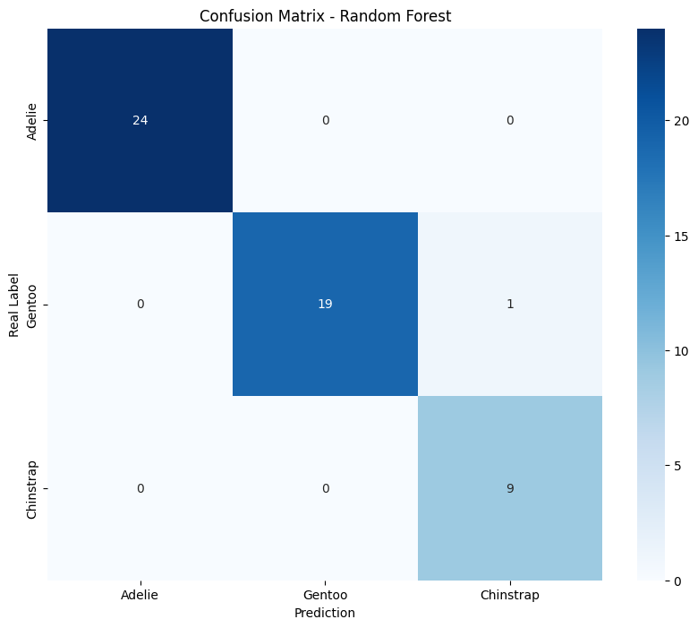
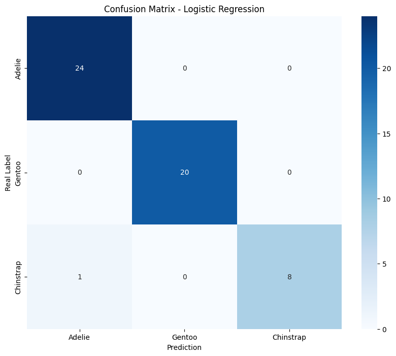

# Section 4 conclussions

|               | **Random Forest** | **Logistic Regression** |
| ------------- | ----------------- | ----------------------- |
| **Accuracy:** | 0.9623            | 0.9811                  |

As can be seen in the accuracy values, the **Logistic Regression** model seems to be just a little bit more accurate than the Random Forest. The difference between both does not mean that one is better than the other for this experiment (and with the current available data) but with Random Forest model, overfitting or underfitting could happen depending on the number of trees or depth.

## Confusion Matrices

Both heat map charts are nearly identical, so both models seems to be optimal for the current task. But it should be mentioned that in case more data is available, this may not be true.

#### Random Forest

#### Logistic Regression

